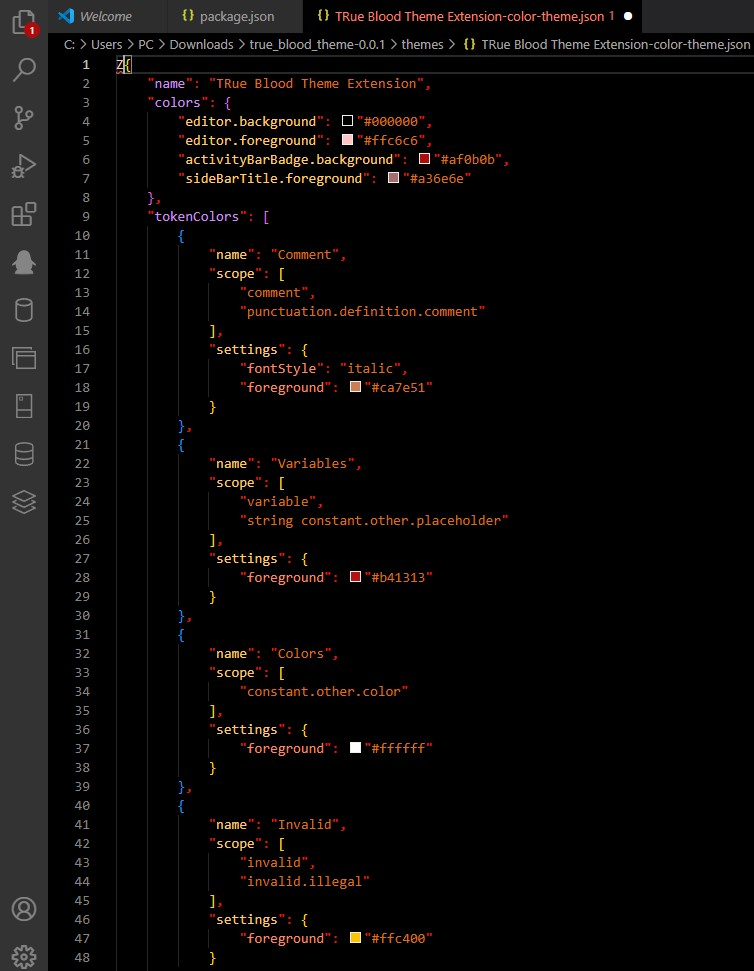
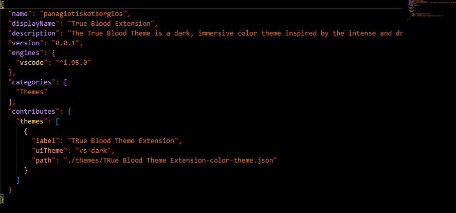
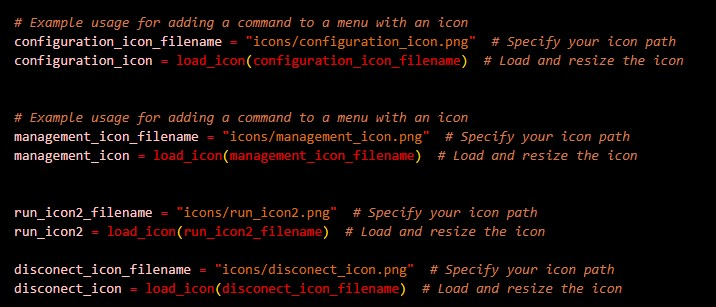
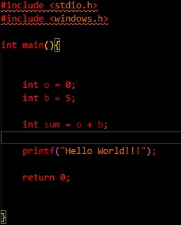
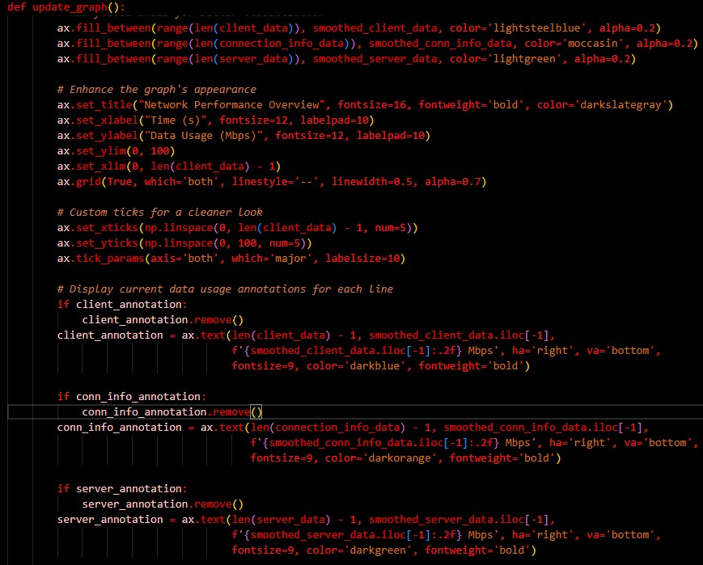

## Installation Instructions;

# How to Add and Use a VS Code Extension Locally

## **For Windows 10**

1. Locate the `.vscode/extensions` folder on your system:
   - Common path: `C:\Users\<username>\.vscode\extensions`

2. Copy the extension folder ex. `<true_blood_folder>` and paste it to the `.vscode/extensions` directory.

3. Restart Visual Studio Code.

4. Apply the extension:
   - Go to **File** → **Preferences** → **Themes** → **Color Themes**.
   - Find your extension in the list, and click it to enable.

---

## **For Linux**

1. Navigate to the folder containing the `.vsix` extension file:
   ```bash
   cd <folder-name>

2. Install the extension using the following command:
    ```bash
    code --install-extension <extension-name>.vsix

3. Restart Visual Studio Code.

4. Apply the extension:

   - Go to File → Preferences → Themes → Color Themes.
   - Select your extension from the list to enable it.


# **True Blood Theme**

A sleek, dark red-colored theme for Visual Studio Code, inspired by the mysterious and bold tones of the night.

## **Preview**
Here are some visuals showcasing the theme:

### **Screenshot 1**


### **Screenshot 2**


### **Screenshot 3**


### **Screenshot 4**


### **Screenshot 5**


---

## **Features**
- Rich, dark tones with striking red highlights.
- Optimized for a comfortable coding experience, especially in low-light environments.
- Perfect for those who love themes with bold contrasts.

---

## Working with Markdown

You can author your README using Visual Studio Code. Here are some useful editor keyboard shortcuts:

* Split the editor (`Cmd+\` on macOS or `Ctrl+\` on Windows and Linux).
* Toggle preview (`Shift+Cmd+V` on macOS or `Shift+Ctrl+V` on Windows and Linux).
* Press `Ctrl+Space` (Windows, Linux, macOS) to see a list of Markdown snippets.

## For more information

* [Visual Studio Code's Markdown Support](http://code.visualstudio.com/docs/languages/markdown)
* [Markdown Syntax Reference](https://help.github.com/articles/markdown-basics/)

**Enjoy!**
